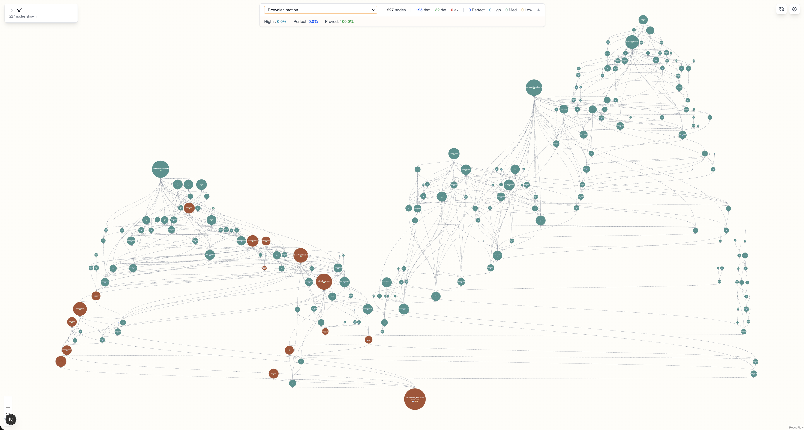
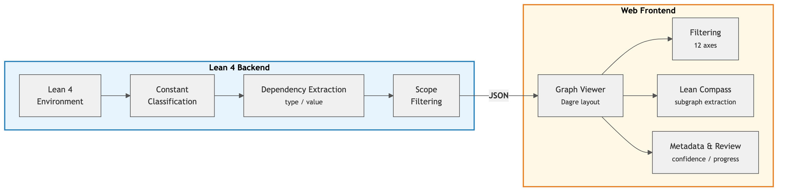
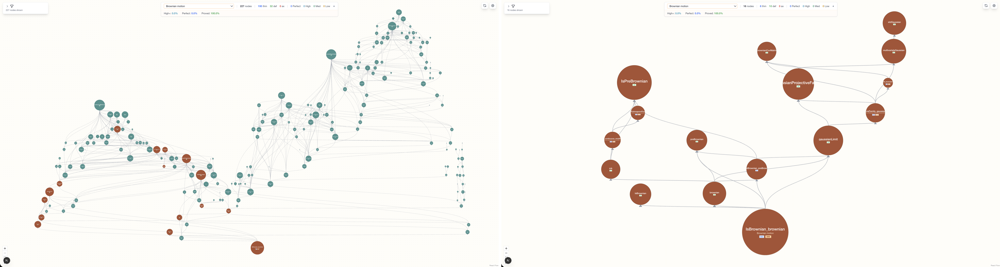

# Lean Atlas

**An Integrated Proof Environment for Scalable Human-AI Collaborative Formalization**

[](LICENSE)
[](https://lean-lang.org/)

[Paper]() | [Demo](https://lean-atlas-demo.vercel.app) | [日本語](README.ja.md)

[Banri Yanahama](https://x.com/banr1_), [Akiyoshi Sannai](https://mlphys.scphys.kyoto-u.ac.jp/organization/member10/)

<p align="center">
  
  <br>
  <em>Lean Atlas visualizing the review cone of <code>IsBrownian_brownian</code> in the Brownian Motion project. Orange nodes (14) are the semantic verification targets extracted by Lean Compass (93.8% reduction from 227 nodes).</em>
</p>

## Overview

AI-driven autoformalization is producing formal proofs at scale, but the type checker only guarantees logical correctness — it does not verify whether propositions actually express the intended mathematics. This gap leads to **semantic hallucination**: code that passes the type checker but fails to capture the original meaning.

**Lean Atlas** is a Lean 4 tool that visualizes the dependency graph of any Lean 4 project as an interactive web viewer, classifying each edge into **type dependencies** (proposition/definition-level) and **value dependencies** (proof-level). Its core algorithm, **Lean Compass**, automatically extracts the minimal set of project-specific nodes whose semantic correctness can affect a target theorem — reducing the candidate set for human review by 27–99% depending on project structure.

## Key Features

- **Interactive dependency graph visualization** — Web-based viewer with 12+ independent filtering axes, hierarchical layout, and source code inspection
- **8-kind edge classification** — Each dependency edge classified along 3 axes: source kind (theorem/definition) × dependency site (type/value) × target kind (theorem/definition)
- **Lean Compass** — Given a target theorem set, automatically prunes proof-level dependencies to extract the nodes that can affect those theorems' semantics
- **Metadata system** — Attach confidence, proof progress, and definition progress to each constant via Lean 4 custom attributes
- **Zero-config support** — Auto-detects project name and namespace from `lakefile.toml` / `lakefile.lean` when `lean-atlas.toml` is absent
- **Review workflow** — Update confidence levels directly from the web viewer; track semantic verification progress across a team

## Architecture

<p align="center">
  
</p>

```
Lean 4 Backend (lake exe atlas graph-data)
    → JSON (web/public/data/graph.json)
        → Next.js Frontend (React Flow + Dagre)
```

The Lean backend traverses all constants in the environment, classifies their dependencies, and exports a JSON graph. The web frontend renders it as an interactive, filterable visualization.

## Getting Started

### Prerequisites

- [Lean 4](https://lean-lang.org/lean4/doc/setup.html) (v4.17.0+)
- [Node.js](https://nodejs.org/) (v18+) and [pnpm](https://pnpm.io/)

### Installation

Add lean-atlas as a Lake dependency in your `lakefile.toml`:

```toml
[[require]]
name = "lean-atlas"
scope = "NyxFoundation"
git = "https://github.com/NyxFoundation/lean-atlas"
rev = "main"
```

Then fetch the dependency:

```bash
lake update lean-atlas
```

### Marking Main Theorems

Before running Lean Atlas, mark the theorems you want to review with the `mainTheorem` flag. Lean Compass uses these as starting points to compute the review cone.

```lean
import LeanAtlas

@[formalMeta "Main Result" "Our main theorem" "Theorem 1.1" mainTheorem]
theorem my_main_theorem : ... := by ...
```

**How to choose main theorems:**
- The final results of your formalization project (e.g., the theorem stated in a paper)
- Any theorem whose semantic correctness you want to verify

Without at least one `mainTheorem`, Lean Compass analysis will be skipped.

### Quick Start

From your Lean project root:

```bash
lake exe atlas
```

This will:
1. Generate the dependency graph as JSON
2. Install web dependencies (if needed)
3. Start the interactive viewer at `http://localhost:5326`

To export graph data without launching the viewer:

```bash
lake exe atlas graph-data --output graph.json --pretty
```

## Configuration

### lean-atlas.toml (optional)

If your project follows standard Lean conventions, Lean Atlas auto-detects the project name and namespace from your lakefile. For custom configuration, create `lean-atlas.toml` in the project root:

```toml
[project]
name = "MyProject"
namespace = "MyProject"

[atlas]
root = ".lake/packages/lean-atlas"  # optional; auto-detected
```

### Metadata Attributes

Annotate your Lean code with metadata for richer visualization:

```lean
import LeanAtlas

-- Confidence in semantic correctness
@[confidence perfect]  -- Human expert verified
theorem main_theorem : P := by ...

@[confidence high]     -- High confidence
def key_definition : T := ...

-- Proof progress
@[proofProgress complete]   -- No sorry
@[proofProgress mostly]     -- Minor gaps
@[proofProgress partially]  -- Substantially complete
@[proofProgress stub]       -- Stub only

-- Definition progress
@[defProgress complete]
@[defProgress partially]

-- Rich metadata (name, summary, paper reference, main theorem flag)
@[formalMeta "Prime Number Theorem" "The PNT via analytic methods" "Theorem 1.1" mainTheorem]
@[confidence perfect]
theorem pnt : ... := by ...
```

## CLI Reference

```
lake exe atlas serve [OPTIONS]
    --port PORT          Web viewer port (default: 5326)
    --no-generate        Skip graph data generation
    --atlas-root PATH    Path to lean-atlas root directory
    --config FILE        Config file (default: lean-atlas.toml)

lake exe atlas graph-data [OPTIONS]
    --output PATH        Output file path (default: stdout)
    --pretty             Pretty-print JSON
    --config FILE        Config file (default: lean-atlas.toml)

lake exe atlas deps [OPTIONS]
    --config FILE        Config file (default: lean-atlas.toml)
```

## Lean Compass

Lean Compass requires at least one theorem marked with `mainTheorem` (via `@[formalMeta ... mainTheorem]`) as the starting point for review cone computation. See [Marking Main Theorems](#marking-main-theorems) for setup instructions.

Lean Compass exploits a key asymmetry: value dependencies from a **theorem's proof** are guaranteed correct by the type checker and can be pruned, while value dependencies from a **definition's implementation** may contain computational content beyond the type signature and must be retained.

<p align="center">
  
  <br>
  <em>Before and after Lean Compass on <code>IsBrownian_brownian</code>: 227 nodes → 14 nodes (93.8% reduction).</em>
</p>

### Evaluation Results

Evaluated on six Lean 4 projects with different structural characteristics:

| Project | Type | Avg. Reduction |
|---------|------|---------------:|
| PrimeNumberTheoremAnd | proof-heavy | 99.5% |
| Carleson | proof-heavy | 96.2% |
| Brownian Motion | proof-heavy | 94.4% |
| PhysLib | mixed (physics) | 69.0% |
| FLT (6 milestones) | mixed | 59.8% |
| XMSS Encoding Scheme | definition-heavy (crypto) | 27.3% |

The best predictor of reduction is the **theorem/definition ratio** inside a review cone, not the project label or size. Proof-heavy cones achieve >90% reduction; definition-heavy cones retain more nodes because definitions contribute directly to statement semantics.

## Citation

If you use Lean Atlas in your research, please cite:

```bibtex
@article{yanahama2026leanatlas,
  title={Lean Atlas: An Integrated Proof Environment for Scalable Human-AI Collaborative Formalization},
  author={Yanahama, Banri and Sannai, Akiyoshi},
  year={2026}
}
```

## Contributing

This project is primarily maintained as a research prototype. We are not actively seeking external contributions at this time, but bug reports and feedback via [Issues](https://github.com/NyxFoundation/lean-atlas/issues) are welcome.

## License

[MIT](LICENSE)
